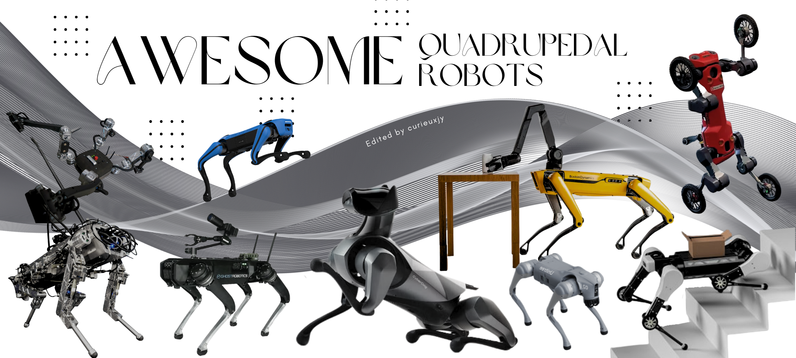
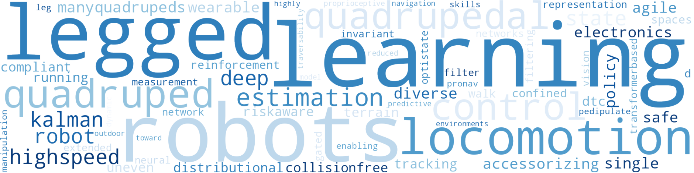
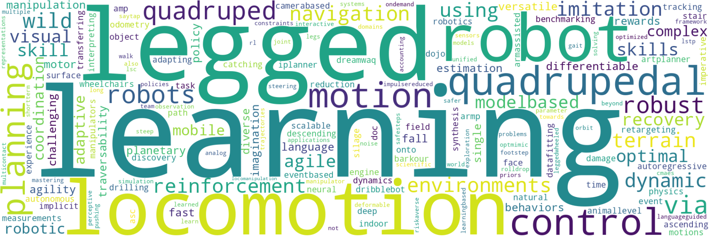
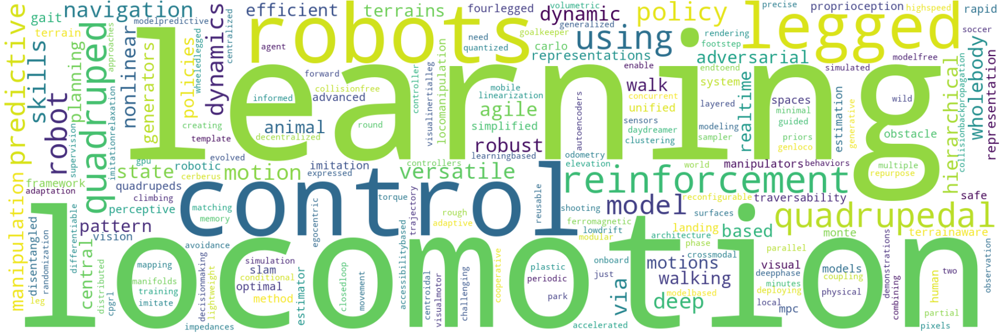
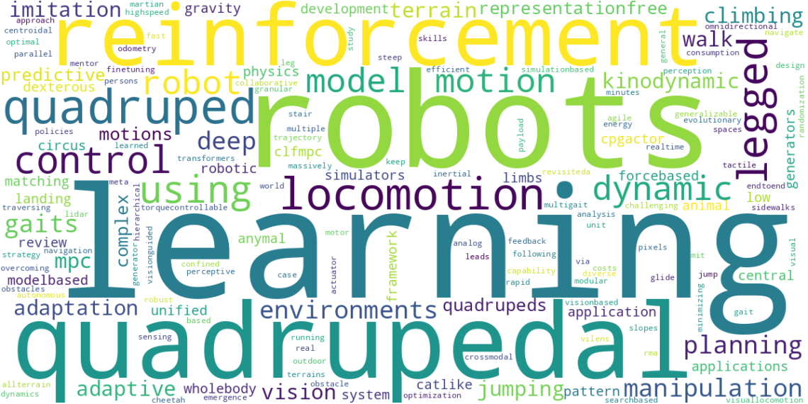
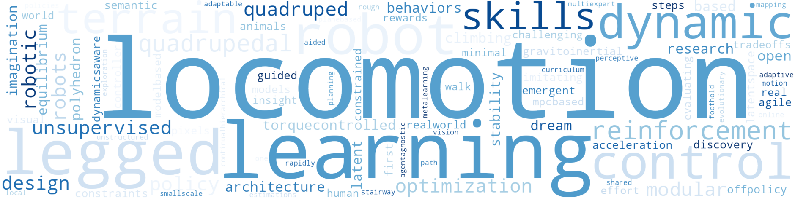
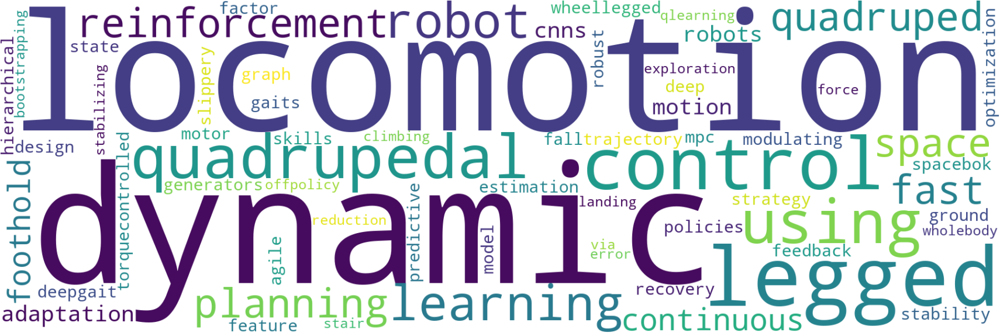
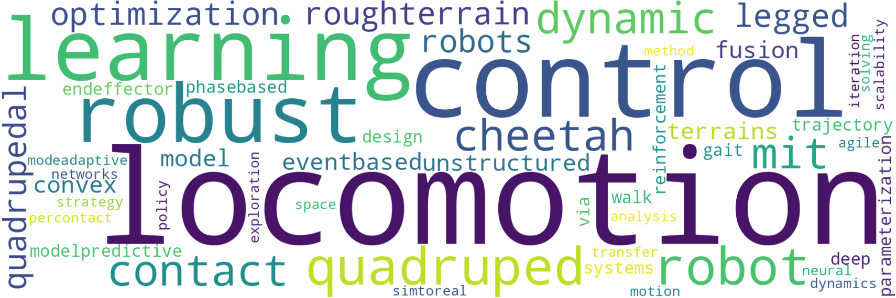
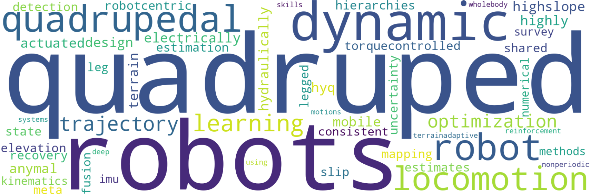

# Awesome_Quadrupedal_Robots 

> Don't hesitate to leave [issues](https://github.com/curieuxjy/Awesome_Quadrupedal_Robots/issues) or [discussions](https://github.com/curieuxjy/Awesome_Quadrupedal_Robots/discussions) to me if there are any corrections or errors.

> 🔤 The items below are in alphabetical order.

## Good to start 🧐

- [Boston Dynamics Spot Robot | All of its Engineering SECRETS!](https://youtu.be/tfWbE_1eCZk)
- [Development of quadruped walking robots: A review](https://doi.org/10.1016/j.asej.2020.11.005)
- [Quadruped Robot Basics](https://youtu.be/O_2swSMecB4)

---

## Quadrupedal Robot 🐅

<b>Platforms</b>

- [AiDIN](https://www.aidinrobotics.co.kr/leggedrobot-aidin)
- [ANYmal](https://rsl.ethz.ch/robots-media/anymal.html)
- [Barkour](https://ai.googleblog.com/2023/05/barkour-benchmarking-animal-level.html)
- [Cheetah](https://biomimetics.mit.edu/)
- [CyberDog 2](https://www.mi.com/cyberdog2)
- [DeepRobotics](https://www.deeprobotics.cn/en/index/product.html)
- [HyQ](https://robots.ieee.org/robots/hyq/)
- [Magnecko](https://magnecko.ethz.ch/)
- [Max](https://www.chinamoneynetwork.com/2021/03/05/tencents-new-robotic-dog-max-has-wheels-on-its-knees-can-travel-at-25km-hour)
- [PongBot](https://rclab.kookmin.ac.kr/project1/quadruped-robot)
- [RBQ](https://www.rainbow-robotics.com/en_rbq)
- [Solo8](https://open-dynamic-robot-initiative.github.io/)
- [Spot](https://www.bostondynamics.com/products/spot)
- [Unitree](https://www.unitree.com/)
- [Vision60](https://www.ghostrobotics.io/vision-60)

---

## Papers 📑
`It could include abroad keywords related to quadrupedal walking robots, e.g. control methods or reinforcement learning`

<b>2024</b>

- [Accessorizing Quadrupedal Robots with Wearable Electronics](https://onlinelibrary.wiley.com/doi/full/10.1002/aisy.202300633)
- [Agile But Safe: Learning Collision-Free High-Speed Legged Locomotion](https://arxiv.org/abs/2401.17583)
- [Cafe-Mpc: A Cascaded-Fidelity Model Predictive Control Framework with Tuning-Free Whole-Body Control](https://arxiv.org/abs/2403.03995)
- [Contrastive Initial State Buffer for Reinforcement Learning](https://rpg.ifi.uzh.ch/docs/ICRA24_Messikommer.pdf)
- [Convergent iLQR for Safe Trajectory Planning and Control of Legged Robots](https://arxiv.org/abs/2304.00346)
- [Deep Compliant Control for Legged Robots](TBD)
- [DrEureka: Language Model Guided Sim-To-Real Transfer](https://eureka-research.github.io/dr-eureka/assets/dreureka-paper.pdf)
- [DTC: Deep Tracking Control](https://www.science.org/doi/10.1126/scirobotics.adh5401)
- [Enhancing Quadruped Robot Locomotion on Deformable Terrains Through Contact Perception and Terrain Classification](https://papers.ssrn.com/sol3/papers.cfm?abstract_id=4682648)
- [Fast Traversability Estimation for Wild Visual Navigation](https://arxiv.org/abs/2305.08510)
- [GeRM: A Generalist Robotic Model with Mixture-of-experts for Quadruped Robot](https://arxiv.org/abs/2403.13358)
- [Hierarchical Open-Vocabulary 3D Scene Graphs for Language-Grounded Robot Navigation](https://arxiv.org/pdf/2403.17846.pdf)
- [Learning Force Control for Legged Manipulation](https://arxiv.org/abs/2405.01402)
- [Learning Quadrupedal High-Speed Running on Uneven Terrain](https://www.mdpi.com/2313-7673/9/1/37)
- [Learning Risk-Aware Quadrupedal Locomotion using Distributional Reinforcement Learning](https://arxiv.org/abs/2309.14246)
- [Learning robust autonomous navigation and locomotion for wheeled-legged robots](https://www.science.org/doi/10.1126/scirobotics.adi9641)
- [Learning to walk in confined spaces using 3D representation](https://arxiv.org/abs/2403.00187)
- [Legged Robot State Estimation With Invariant Extended Kalman Filter Using Neural Measurement Network](https://arxiv.org/abs/2402.00366)
- [ManyQuadrupeds: Learning a Single Locomotion Policy for Diverse Quadruped Robots](https://arxiv.org/abs/2310.10486)
- [MQE: Unleashing the Power of Interaction with Multi-agent Quadruped Environment](https://arxiv.org/abs/2403.16015)
- [OptiState: State Estimation of Legged Robots using Gated Networks with Transformer-based Vision and Kalman Filtering](https://arxiv.org/abs/2401.16719)
- [Pedipulate: Enabling Manipulation Skills using a Quadruped Robot's Leg](https://arxiv.org/abs/2402.10837)
- [ProNav: Proprioceptive Traversability Estimation for Legged Robot Navigation in Outdoor Environments](https://arxiv.org/abs/2307.09754)
- [Reduced Model Predictive Control Toward Highly Dynamic Quadruped Locomotion](https://ieeexplore.ieee.org/document/10418132/)
- [Sim-to-Real: A Performance Comparison of PPO, TD3, and SAC Reinforcement Learning Algorithms for Quadruped Walking Gait Generation](https://www.scirp.org/journal/paperinformation?paperid=131938)
- [Track2Act: Predicting Point Tracks from Internet Videos enables Diverse Zero-shot Robot Manipulation](https://arxiv.org/abs/2405.01527)
- [Understanding URDF: A Dataset and Analysis](https://ieeexplore.ieee.org/abstract/document/10478618)
- [Viability leads to the emergence of gait transitions in learning agile quadrupedal locomotion on challenging terrains](https://www.nature.com/articles/s41467-024-47443-w)
- [ViPlanner: Visual Semantic Imperative Learning for Local Navigation](https://arxiv.org/abs/2310.00982)
- [Visual Whole-Body Control for Legged Loco-Manipulation](https://arxiv.org/abs/2403.16967)
- [VLFM: Vision-Language Frontier Maps for Zero-Shot Semantic Navigation](https://arxiv.org/abs/2312.03275)

<b>2023</b>

- [Adaptive Locomotion Learning for Quadruped Robots by Combining DRL with a Cosine Oscillator Based Rhythm Controller](https://www.mdpi.com/2076-3417/13/19/11045)
- [Adaptive walking control for quadruped robot by using oscillation patterns](https://www.nature.com/articles/s42256-022-00576-3)
- [AMP in the wild: Learning robust, agile, natural legged locomotion skills](https://arxiv.org/abs/2304.10888)
- [ANYmal Parkour: Learning Agile Navigation for Quadrupedal Robots](https://arxiv.org/abs/2306.14874)
- [ARMP: Autoregressive Motion Planning for Quadruped Locomotion and Navigation in Complex Indoor Environments](https://arxiv.org/abs/2303.15900)
- [ArtPlanner: Robust Legged Robot Navigation in the Field](https://arxiv.org/abs/2303.01420)
- [ASC: Adaptive Skill Coordination for Robotic Mobile Manipulation](https://arxiv.org/abs/2304.00410)
- [Autonomous Stair Ascending and Descending by Quadruped Wheelchairs](https://ieeexplore.ieee.org/abstract/document/10202377)
- [Barkour: Benchmarking Animal-level Agility with Quadruped Robots](https://arxiv.org/abs/2305.14654)
- [Barry: A High-Payload and Agile Quadruped Robot](https://ieeexplore.ieee.org/document/10246325)
- [Combining model-predictive control and predictive reinforcement learning for stable quadrupedal robot locomotion](https://arxiv.org/abs/2307.07752)
- [Controlling the Solo12 quadruped robot with deep reinforcement learning](https://www.nature.com/articles/s41598-023-38259-7)
- [Curiosity-Driven Learning of Joint Locomotion and Manipulation Tasks](https://openreview.net/forum?id=QG_ERxtDAP-&referrer=%5Bthe%20profile%20of%20Marco%20Hutter%5D(%2Fprofile%3Fid%3D~Marco_Hutter1))
- [DeepTransition: Viability Leads to the Emergence of Gait Transitions in Learning Anticipatory Quadrupedal Locomotion Skills](https://arxiv.org/abs/2306.07419)
- [DOC: Differentiable Optimal Control for Retargeting Motions onto Legged Robots](https://la.disneyresearch.com/wp-content/uploads/DOC_paper.pdf)
- [Dojo: A Differentiable Physics Engine for Robotics](https://arxiv.org/abs/2203.00806)
- [DreamWaQ: Learning Robust Quadrupedal Locomotion With Implicit Terrain Imagination via Deep Reinforcement Learning](https://arxiv.org/abs/2301.10602)
- [DribbleBot: Dynamic Legged Manipulation in the Wild](https://gmargo11.github.io/dribblebot/rsc/dribblebot_paper.pdf)
- [Drilling Task with a Quadruped Robot for Silage Face Measurements](https://www.researchgate.net/publication/370765569_Drilling_Task_with_a_Quadruped_Robot_for_Silage_Face_Measurements)
- [DTC: Deep Tracking Control - A Unifying Approach to Model-Based Planning and Reinforcement-Learning for Versatile and Robust Locomotion](https://arxiv.org/abs/2309.15462)
- [Event Camera-based Visual Odometry for Dynamic Motion Tracking of a Legged Robot Using Adaptive Time Surface](https://arxiv.org/abs/2305.08962)
- [Event-based Agile Object Catching with a Quadrupedal Robot](https://arxiv.org/abs/2303.17479)
- [Extreme Parkour with Legged Robots](https://arxiv.org/abs/2309.14341)
- [Fast Traversability Estimation for Wild Visual Navigation](https://arxiv.org/abs/2305.08510)
- [From Data-Fitting to Discovery: Interpreting the Neural Dynamics of Motor Control through Reinforcement Learning](https://arxiv.org/abs/2305.11107)
- [Geometric Mechanics of Contact-Switching Systems](https://arxiv.org/abs/2306.10276)
- [Grow Your Limits: Continuous Improvement with Real-World RL for Robotic Locomotion](https://arxiv.org/abs/2310.17634)
- [Guardians as You Fall: Active Mode Transition for Safe Falling](https://arxiv.org/abs/2310.04828)
- [Hierarchical Experience-informed Navigation for Multi-modal Quadrupedal Rebar Grid Traversal](https://arxiv.org/abs/2311.08354)
- [Identifying important sensory feedback for learning locomotion skills](https://www.nature.com/articles/s42256-023-00701-w)
- [Intelligent Control of Multilegged Robot Smooth Motion: A Review](https://ieeexplore.ieee.org/document/10216974)
- [iPlanner: Imperative Path Planning](https://arxiv.org/abs/2302.11434)
- [Language to Rewards for Robotic Skill Synthesis](https://arxiv.org/abs/2306.08647)
- [Layered Control for Cooperative Locomotion of Two Quadrupedal Robots: Centralized and Distributed Approaches](https://ieeexplore.ieee.org/document/10281391)
- [Learning a Single Policy for Diverse Behaviors on a Quadrupedal Robot using Scalable Motion Imitation](https://arxiv.org/abs/2303.15331)
- [Learning Agility and Adaptive Legged Locomotion via Curricular Hindsight Reinforcement Learning](https://arxiv.org/abs/2310.15583)
- [Learning and Adapting Agile Locomotion Skills by Transferring Experience](https://arxiv.org/abs/2304.09834)
- [Learning Arm-Assisted Fall Damage Reduction and Recovery for Legged Mobile Manipulators](https://www.research-collection.ethz.ch/handle/20.500.11850/595246)
- [Learning Complex Motor Skills for Legged Robot Fall Recovery](https://ieeexplore.ieee.org/document/10138662/)
- [Learning Impulse-Reduced Gait for Quadruped Robot using CMA-ES](https://ieeexplore.ieee.org/abstract/document/10202519)
- [Learning Low-Frequency Motion Control for Robust and Dynamic Robot Locomotion](https://arxiv.org/abs/2209.14887)
- [Learning Multiple Gaits within Latent Space for Quadruped Robots](https://arxiv.org/abs/2308.03014)
- [Learning Quadruped Locomotion using Bio-Inspired Neural Networks with Intrinsic Rhythmicity](https://arxiv.org/abs/2305.07300)
- [Learning quadrupedal locomotion on deformable terrain](https://www.science.org/doi/full/10.1126/scirobotics.ade2256)
- [Learning Robust Perception-Based Controller for Quadruped Robot](https://ieeexplore.ieee.org/document/10237187)
- [Learning to Exploit Elastic Actuators for Quadruped Locomotion](https://arxiv.org/abs/2209.07171)
- [Learning to Walk by Steering: Perceptive Quadrupedal Locomotion in Dynamic Environments](https://arxiv.org/abs/2209.09233)
- [Learning Whole-body Manipulation for Quadrupedal Robot](https://arxiv.org/abs/2308.16820)
- [Legs as Manipulator: Pushing Quadrupedal Agility Beyond Locomotion](https://arxiv.org/abs/2303.11330)
- [Lifelike Agility and Play on Quadrupedal Robots using Reinforcement Learning and Generative Pre-trained Models](https://arxiv.org/abs/2308.15143)
- [LSC: Language-guided Skill Coordination](https://languageguidedskillcoordination.github.io/)
- [LSTP: Long Short-Term Motion Planning for Legged and Legged-Wheeled Systems](https://www.research-collection.ethz.ch/handle/20.500.11850/625515)
- [Mastering Diverse Domains through World Models](https://arxiv.org/abs/2301.04104)
- [Max: A Wheeled-Legged Quadruped Robot for Multimodal Agile Locomotion](https://ieeexplore.ieee.org/document/10375960)
- [Multi-Contact Whole Body Force Control for Position-Controlled Robots](https://arxiv.org/abs/2312.16465)
- [Not Only Rewards But Also Constraints: Applications on Legged Robot Locomotion](https://arxiv.org/abs/2308.12517)
- [OPT-Mimic: Imitation of Optimized Trajectories for Dynamic Quadruped Behaviors](https://arxiv.org/abs/2210.01247)
- [ORBIT: A Unified Simulation Framework for Interactive Robot Learning Environments](https://ieeexplore.ieee.org/abstract/document/10107764)
- [Orthrus: A Dual-arm Quadrupedal Robot for Mobile Manipulation and Entertainment Applications](https://ieeexplore.ieee.org/document/10309339)
- [Puppeteer and Marionette: Learning Anticipatory Quadrupedal Locomotion Based on Interactions of a Central Pattern Generator and Supraspinal Drive](https://arxiv.org/abs/2302.13378)
- [PyPose: A Library for Robot Learning with Physics-based Optimization](https://arxiv.org/abs/2209.15428)
- [QUAR-VLA: Vision-Language-Action Model for Quadruped Robots](https://arxiv.org/abs/2312.14457)
- [Real-Time Collision-Free Motion Planning and Control for Mobile Manipulation with Quadrupeds](https://ieeexplore.ieee.org/abstract/document/10354901)
- [Reinforcement Learning for Legged Robots: Motion Imitation from Model-Based Optimal Control](https://arxiv.org/abs/2305.10989)
- [Reinforcement Learning from Multiple Sensors via Joint Representations](https://arxiv.org/abs/2302.05342)
- [Resilient Legged Local Navigation: Learning to Traverse with Compromised Perception End-to-End](https://arxiv.org/abs/2310.03581)
- [Responsive CPG-Based Locomotion Control for Quadruped Robots](https://link.springer.com/chapter/10.1007/978-981-99-8073-4_22)
- [RL + Model-based Control: Using On-demand Optimal Control to Learn Versatile Legged Locomotion](https://arxiv.org/abs/2305.17842)
- [RoboHive: A Unified Framework for Robot Learning](https://arxiv.org/abs/2310.06828)
- [Robot Parkour Learning](https://openreview.net/forum?id=uo937r5eTE)
- [Robust Quadrupedal Locomotion via Risk-Averse Policy Learning](https://arxiv.org/abs/2308.09405)
- [Robust Recovery Motion Control for Quadrupedal Robots via Learned Terrain Imagination](https://arxiv.org/abs/2306.12712)
- [Roll-Drop: accounting for observation noise with a single parameter](https://arxiv.org/abs/2304.13150)
- [SafeSteps: Learning Safer Footstep Planning Policies for Legged Robots via Model-Based Priors](https://arxiv.org/abs/2307.12664.pdf)
- [SayTap: Language to Quadrupedal Locomotion](https://arxiv.org/abs/2306.07580)
- [Scientific Exploration of Challenging Planetary Analog Environments with a Team of Legged Robots](https://arxiv.org/abs/2307.10079)
- [Skill Graph for Real-world Quadrupedal Robot Reinforcement Learning](https://openreview.net/forum?id=vdm4WnG5u-M)
- [SLoMo: A General System for Legged Robot Motion Imitation From Casual Videos](https://ieeexplore.ieee.org/abstract/document/10246373)
- [Solving Challenging Control Problems via Learning-based Motion Planning and Imitation](https://ieeexplore.ieee.org/abstract/document/10202250)
- [Taking the First Step Toward Autonomous Quadruped Robots: The Quadruped Robot Challenge at ICRA 2023 in London [Competitions]](https://doi.org/10.1109/MRA.2023.3293296)
- [Terrain-Aware Quadrupedal Locomotion via Reinforcement Learning](https://arxiv.org/abs/2310.04675)
- [Towards Legged Locomotion on Steep Planetary Terrain](https://www.research-collection.ethz.ch/handle/20.500.11850/625001)
- [Tuning Legged Locomotion Controllers via Safe Bayesian Optimization](https://arxiv.org/abs/2306.07092)
- [Versatile Multi-Contact Planning and Control for Legged Loco-Manipulation](https://www.science.org/doi/10.1126/scirobotics.adg5014)

<b>2022</b>

- [A Collision-Free MPC for Whole-Body Dynamic Locomotion and Manipulation](https://arxiv.org/abs/2202.12385v1)
- [A Linearization of Centroidal Dynamics for the Model-Predictive Control of Quadruped Robots](https://ieeexplore.ieee.org/document/9812433)
- [A Reconfigurable Leg for Walking Robots](https://ieeexplore.ieee.org/document/9667211)
- [A Walk in the Park: Learning to Walk in 20 Minutes With Model-Free Reinforcement Learning](https://arxiv.org/abs/2208.07860)
- [A Whole-Body Controller Based on a Simplified Template for Rendering Impedances in Quadruped Manipulators](https://arxiv.org/abs/2208.00810)
- [A1 SLAM: Quadruped SLAM using the A1's Onboard Sensors](https://arxiv.org/abs/2211.14432)
- [Accelerated Policy Learning with Parallel Differentiable Simulation](https://arxiv.org/abs/2204.07137)
- [Accessibility-Based Clustering for Efficient Learning of Locomotion Skills](https://arxiv.org/abs/2109.11191)
- [Advanced Skills by Learning Locomotion and Local Navigation End-to-End](https://arxiv.org/abs/2209.12827)
- [Advanced Skills through Multiple Adversarial Motion Priors in Reinforcement Learning](https://doi.org/10.48550/arXiv.2203.14912)
- [Agile and versatile climbing on ferromagnetic surfaces with a quadrupedal robot](https://www.science.org/doi/10.1126/scirobotics.add1017)
- [Animal Motions on Legged Robots Using Nonlinear Model Predictive Control](https://ieeexplore.ieee.org/document/9981945)
- [Articulated Object Interaction in Unknown Scenes with Whole-Body Mobile Manipulation](https://arxiv.org/abs/2103.10534)
- [Bio-Inspired Rhythmic Locomotion for Quadruped Robots](https://ieeexplore.ieee.org/document/9780216)
- [Central pattern generators evolved for real-time adaptation](https://arxiv.org/abs/2210.08102)
- [Cerberus: Low-Drift Visual-Inertial-Leg Odometry For Agile Locomotion](https://arxiv.org/abs/2209.07654)
- [Collision-Backpropagation based Obstacle Avoidance Method for a Legged Robot Expressed as a Simplified Dynamics Model](https://ieeexplore.ieee.org/document/10003733)
- [Combining Learning-Based Locomotion Policy With Model-Based Manipulation for Legged Mobile Manipulators](https://ieeexplore.ieee.org/abstract/document/9684679)
- [Concurrent Training of a Control Policy and a State Estimator for Dynamic and Robust Legged Locomotion](https://doi.org/10.1109/LRA.2022.3151396)
- [Control of Wheeled-Legged Quadrupeds Using Deep Reinforcement Learning](https://link.springer.com/chapter/10.1007/978-3-031-15226-9_14)
- [Coupling Vision and Proprioception for Navigation of Legged Robots](https://arxiv.org/abs/2112.02094)
- [CPG-RL: Learning Central Pattern Generators for Quadruped Locomotion](https://arxiv.org/abs/2211.00458)
- [Creating a Dynamic Quadrupedal Robotic Goalkeeper with Reinforcement Learning](https://arxiv.org/abs/2210.04435)
- [DayDreamer: World Models for Physical Robot Learning](https://openreview.net/forum?id=3RBY8fKjHeu)
- [Deep Hierarchical Planning from Pixels](https://arxiv.org/abs/2206.04114)
- [Deep reinforcement learning for real-world quadrupedal locomotion: a comprehensive review](https://www.oaepublish.com/articles/ir.2022.20)
- [Deep Whole-Body Control: Learning a Unified Policy for Manipulation and Locomotion](https://arxiv.org/abs/2210.10044)
- [DeepPhase: periodic autoencoders for learning motion phase manifolds](https://dl.acm.org/doi/10.1145/3528223.3530178)
- [DMAP: a Distributed Morphological Attention Policy for Learning to Locomote with a Changing Body](https://arxiv.org/abs/2209.14218)
- [Elevation Mapping for Locomotion and Navigation using GPU](https://arxiv.org/abs/2204.12876)
- [Factor Graph Fusion of Raw GNSS Sensing with IMU and Lidar for Precise Robot Localization without a Base Station](https://arxiv.org/abs/2209.14649)
- [GenLoco: Generalized Locomotion Controllers for Quadrupedal Robots](https://openreview.net/forum?id=mqry_xMzvCM)
- [Hierarchical Adaptive Loco-manipulation Control for Quadruped Robots](https://arxiv.org/abs/2209.13145)
- [Hierarchical Decentralized Deep Reinforcement Learning Architecture for a Simulated Four-Legged Agent](https://arxiv.org/abs/2210.08003)
- [Hierarchical Reinforcement Learning for Precise Soccer Shooting Skills using a Quadrupedal Robot](https://arxiv.org/abs/2208.01160)
- [High-speed quadrupedal locomotion by imitation-relaxation reinforcement learning](https://www.nature.com/articles/s42256-022-00576-3)
- [Human Motion Control of Quadrupedal Robots using Deep Reinforcement Learning](https://arxiv.org/abs/2204.13336)
- [Imitate and Repurpose: Learning Reusable Robot Movement Skills From Human and Animal Behaviors](https://arxiv.org/abs/2203.17138)
- [Is Conditional Generative Modeling all you need for Decision-Making?](https://arxiv.org/abs/2211.15657)
- [Just Round: Quantized Observation Spaces Enable Memory Efficient Learning of Dynamic Locomotion](https://arxiv.org/abs/2210.08065)
- [Landing control method of a lightweight four-legged landing and walking robot](https://link.springer.com/article/10.1007/s11465-022-0707-1)
- [Layered Control for Cooperative Locomotion of Two Quadrupedal Robots: Centralized and Distributed Approaches](https://arxiv.org/abs/2211.06913)
- [Learning a Unified Policy for Whole-Body Control of Manipulation and Locomotion](https://openreview.net/forum?id=zldI4UpuG7v)
- [Learning Agile Skills via Adversarial Imitation of Rough Partial Demonstrations](https://arxiv.org/abs/2206.11693)
- [Learning and Deploying Robust Locomotion Policies with Minimal Dynamics Randomization](https://arxiv.org/abs/2209.12878)
- [Learning Footstep Planning for the Quadrupedal Locomotion with Model Predictive Control](https://link.springer.com/chapter/10.1007/978-3-030-97672-9_4)
- [Learning Forward Dynamics Model and Informed Trajectory Sampler for Safe Quadruped Navigation](https://doi.org/10.48550/arXiv.2204.08647)
- [Learning Free Gait Transition for Quadruped Robots via Phase-Guided Controller](https://arxiv.org/abs/2201.00206)
- [Learning Low-Frequency Motion Control for Robust and Dynamic Robot Locomotion](https://arxiv.org/abs/2209.14887)
- [Learning Modular Robot Visual-motor Locomotion Policies](https://arxiv.org/abs/2210.17486)
- [Learning plastic matching of robot dynamics in closed-loop central pattern generators](https://www.nature.com/articles/s42256-022-00505-4)
- [Learning robust perceptive locomotion for quadrupedal robots in the wild](https://doi.org/10.1126/scirobotics.abk2822)
- [Learning Torque Control for Quadrupedal Locomotion](https://doi.org/10.48550/arXiv.2203.05194)
- [Learning Visual Locomotion with Cross-Modal Supervision](https://arxiv.org/abs/2211.03785)
- [Legged Locomotion in Challenging Terrains using Egocentric Vision](https://openreview.net/forum?id=Re3NjSwf0WF)
- [Locomotion Policy Guided Traversability Learning using Volumetric Representations of Complex Environments](https://arxiv.org/abs/2203.15854)
- [Meta Reinforcement Learning for Optimal Design of Legged Robots](https://ieeexplore.ieee.org/abstract/document/9910025)
- [Model Predictive Control of Quadruped Robot Based on Reinforcement Learning](https://doi.org/10.3390/app13010154)
- [Monte Carlo Tree Search Gait Planner for Non-Gaited Legged System Control](https://arxiv.org/abs/2205.14277)
- [Multi-Modal Legged Locomotion Framework With Automated Residual Reinforcement Learning](https://ieeexplore.ieee.org/document/9830825)
- [Neural Scene Representation for Locomotion on Structured Terrain](https://arxiv.org/abs/2206.08077)
- [Next Steps: Learning a Disentangled Gait Representation for Versatile Quadruped Locomotion](https://ieeexplore.ieee.org/document/9811584)
- [Nonlinear Model Predictive Control for Quadrupedal Locomotion Using Second-Order Sensitivity Analysis](https://arxiv.org/abs/2207.10465)
- [Online Kinematic Calibration for Legged Robots](https://ieeexplore.ieee.org/document/9807408)
- [Perceptive Locomotion through Nonlinear Model Predictive Control](https://arxiv.org/abs/2208.08373)
- [PI-ARS: Accelerating Evolution-Learned Visual-Locomotion with Predictive Information Representations](https://arxiv.org/abs/2207.13224)
- [PrePARE: Predictive Proprioception for Agile Failure Event Detection in Robotic Exploration of Extreme Terrains](https://arxiv.org/abs/2208.00322)
- [PSTO: Learning Energy-Efficient Locomotion for Quadruped Robots](https://doi.org/10.3390/machines10030185)
- [Quadruped Reinforcement Learning without Explicit State Estimation](https://ieeexplore.ieee.org/document/10011765)
- [Rapid and Reliable Quadruped Motion Planning with Omnidirectional Jumping](https://arxiv.org/abs/2111.13648?context=cs)
- [Rapid Locomotion via Reinforcement Learning](https://arxiv.org/abs/2205.02824#)
- [Real-time Digital Double Framework to Predict Collapsible Terrains for Legged Robots](https://arxiv.org/abs/2209.09508)
- [REvolveR: Continuous Evolutionary Models for Robot-to-robot Policy Transfer](https://arxiv.org/abs/2202.05244)
- [RLOC: Terrain-Aware Legged Locomotion using Reinforcement Learning and Optimal Control](https://arxiv.org/abs/2012.03094)
- [RoLoMa: Robust Loco-Manipulation for Quadruped Robots with Arms](https://arxiv.org/abs/2203.01446)
- [Safe Reinforcement Learning for Legged Locomotion](https://doi.org/10.48550/arXiv.2203.02638)
- [Sample Efficient Dynamics Learning for Symmetrical Legged Robots:Leveraging Physics Invariance and Geometric Symmetries](https://arxiv.org/abs/2210.07329)
- [Saving the Limping: Fault-tolerant Quadruped Locomotion via Reinforcement Learning](https://arxiv.org/abs/2210.00474)
- [State Estimation for Hybrid Locomotion of Driving-Stepping Quadrupeds](https://arxiv.org/abs/2211.11390)
- [STEP: State Estimator for Legged Robots Using a Preintegrated foot Velocity Factor](https://arxiv.org/abs/2202.05572)
- [TROT-Q: Traversability and Obstacle Aware Target Tracking System for Quadruped Robots](https://ieeexplore.ieee.org/document/9828258)
- [Unsupervised Learning of Terrain Representations for Haptic Monte Carlo Localization](https://ieeexplore.ieee.org/document/9812296)
- [VAE-Loco: Versatile Quadruped Locomotion by Learning a Disentangled Gait Representation](https://arxiv.org/abs/2205.01179)
- [Versatile Real-Time Motion Synthesis via Kino-Dynamic MPC with Hybrid-Systems DDP](https://arxiv.org/abs/2209.14138)
- [Versatile Skill Control via Self-supervised Adversarial Imitation of Unlabeled Mixed Motions](https://arxiv.org/abs/2209.07899)
- [ViNL: Visual Navigation and Locomotion Over Obstacles](https://arxiv.org/abs/2210.14791)
- [ViTAL: Vision-Based Terrain-Aware Locomotion for Legged Robots](https://ieeexplore.ieee.org/document/9966331)
- [Walk These Ways: Gait-conditioned Policies Yield Diversified Quadrupedal Agility](https://openreview.net/forum?id=52c5e73SlS2)
- [Walking in Narrow Spaces: Safety-critical Locomotion Control for Quadrupedal Robots with Duality-based Optimization](https://arxiv.org/abs/2212.14199)

<b>2021</b>

- [A Review of Physics Simulators for Robotic Applications](https://ieeexplore.ieee.org/document/9386154/)
- [A Unified MPC Framework for Whole-Body Dynamic Locomotion and Manipulation](https://arxiv.org/abs/2103.00946)
- [Adaptive CLF-MPC With Application to Quadrupedal Robots](https://doi.org/10.1109/LRA.2021.3128697)
- [Adaptive Force-based Control for Legged Robots](https://arxiv.org/abs/2011.06236)
- [Animal Gaits on Quadrupedal Robots Using Motion Matching and Model-Based Control](https://ieeexplore.ieee.org/document/9635838)
- [Cat-Like Jumping and Landing of Legged Robots in Low Gravity Using Deep Reinforcement Learning](https://doi.org/10.1109/TRO.2021.3084374)
- [Circus ANYmal: A Quadruped Learning Dexterous Manipulation with Its Limbs](https://ieeexplore.ieee.org/abstract/document/9561926)
- [CPG-ACTOR: Reinforcement Learning for Central Pattern Generators](https://arxiv.org/abs/2102.12891)
- [CPG-Based Hierarchical Locomotion Control for Modular Quadrupedal Robots Using Deep Reinforcement Learning](https://ieeexplore.ieee.org/document/9465716)
- [Development of a Quadruped Robot System With Torque-Controllable Modular Actuator Unit](https://doi.org/10.1109/TIE.2020.3007084)
- [Dynamics Randomization Revisited:A Case Study for Quadrupedal Locomotion](https://arxiv.org/abs/2011.02404)
- [Efficient Motion Planning Based on Kinodynamic Model for Quadruped Robots Following Persons in Confined Spaces](https://ieeexplore.ieee.org/document/9440744)
- [Fast and Efficient Locomotion via Learned Gait Transitions](https://arxiv.org/abs/2104.04644)
- [GLiDE: Generalizable Quadrupedal Locomotion in Diverse Environments with a Centroidal Model](https://arxiv.org/abs/2104.09771?context=cs)
- [Imitation Learning by Reinforcement Learning](https://doi.org/10.48550/arXiv.2108.04763)
- [Imitation Learning from MPC for Quadrupedal Multi-Gait Control](https://doi.org/10.1109/ICRA48506.2021.9561444)
- [Jumping over obstacles with MIT Cheetah 2](https://doi.org/10.1016/j.robot.2020.103703)
- [Learning Agile Locomotion Skills with a Mentor](https://doi.org/10.1109/ICRA48506.2021.9561567)
- [Learning Fast Adaptation with Meta Strategy Optimization](https://doi.org/10.48550/arXiv.1909.12995)
- [Learning multiple gaits of quadruped robot using hierarchical reinforcement learning](https://doi.org/10.48550/arXiv.2112.04741)
- [Learning to Jump from Pixels](https://arxiv.org/abs/2110.15344)
- [Learning to Navigate Sidewalks in Outdoor Environments](https://doi.org/10.48550/arXiv.2109.05603)
- [Learning to Walk in Minutes Using Massively Parallel Deep Reinforcement Learning](https://doi.org/10.48550/arXiv.2109.11978)
- [Learning Vision-Guided Quadrupedal Locomotion End-to-End with Cross-Modal Transformers](https://doi.org/10.48550/arXiv.2107.03996)
- [Legged Robots that Keep on Learning: Fine-Tuning Locomotion Policies in the Real World](https://doi.org/10.48550/arXiv.2110.05457)
- [Minimizing Energy Consumption Leads to the Emergence of Gaits in Legged Robots](https://doi.org/10.48550/arXiv.2111.01674)
- [Obstacle Overcoming Gait Design for Quadruped Robot with Vision and Tactile Sensing Feedback](https://ieeexplore.ieee.org/document/9638875)
- [Perceptive Autonomous Stair Climbing for Quadrupedal Robots](https://ieeexplore.ieee.org/document/9636302)
- [Real-time Optimal Navigation Planning Using Learned Motion Costs](https://ieeexplore.ieee.org/document/9561861)
- [Reinforcement Learning for Collaborative Quadrupedal Manipulation of a Payload over Challenging Terrain](https://ieeexplore.ieee.org/document/9551481)
- [Reinforcement Learning with Evolutionary Trajectory Generator: A General Approach for Quadrupedal Locomotion](https://doi.org/10.48550/arXiv.2109.06409)
- [Representation-Free Model Predictive Control for Dynamic Motions in Quadrupeds](https://arxiv.org/abs/2012.10002)
- [RMA: Rapid Motor Adaptation for Legged Robots](https://doi.org/10.48550/arXiv.2107.04034)
- [Robust High-speed Running for Quadruped Robots via Deep Reinforcement Learning](https://arxiv.org/abs/2103.06484)
- [Search-based Kinodynamic Motion Planning for Omnidirectional Quadruped Robots](https://arxiv.org/abs/2011.00806)
- [Simulation-Based Climbing Capability Analysis for Quadrupedal Robots](https://www.research-collection.ethz.ch/handle/20.500.11850/501538)
- [Traversing Steep and Granular Martian Analog Slopes With a Dynamic Quadrupedal Robot](https://arxiv.org/abs/2106.01974)
- [VILENS: Visual, Inertial, Lidar, and Leg Odometry for All-Terrain Legged Robots](https://doi.org/10.48550/arXiv.2107.07243)
- [VILENS: Visual, Inertial, Lidar, and Leg Odometryfor All-Terrain Legged Robots](https://arxiv.org/abs/2107.07243)
- [Vision-based Terrain Perception of Quadruped Robots in Complex Environments](https://ieeexplore.ieee.org/document/9739576)
- [Visual-Locomotion: Learning to Walk on Complex Terrains with Vision](https://openreview.net/forum?id=NDYbXf-DvwZ)

<b>2020</b>

- [An Open Torque-Controlled Modular Robot Architecture for Legged Locomotion Research](https://ieeexplore.ieee.org/document/9015985)
- [Dream to Control: Learning Behaviors by Latent Imagination](https://arxiv.org/abs/1912.01603)
- [Dynamic equilibrium of climbing robots based on stability polyhedron for gravito-inertial acceleration](https://clawar.org/wp-content/uploads/2021/02/Clawar2020_Paper_18.pdf)
- [Dynamics-Aware Unsupervised Discovery of Skills](https://arxiv.org/abs/1907.01657)
- [Emergent Real-World Robotic Skills via Unsupervised Off-Policy Reinforcement Learning](https://arxiv.org/abs/2004.12974)
- [First Steps: Latent-Space Control with Semantic Constraints for Quadruped Locomotion](https://arxiv.org/abs/2007.01520)
- [Guided Constrained Policy Optimization for Dynamic Quadrupedal Robot Locomotion](https://ieeexplore.ieee.org/abstract/document/9028178)
- [Learning Agile Robotic Locomotion Skills by Imitating Animals](https://doi.org/10.48550/arXiv.2004.00784)
- [Learning quadrupedal locomotion over challenging terrain](https://doi.org/10.1126/scirobotics.abc5986)
- [Learning to Walk in the Real World with Minimal Human Effort](https://arxiv.org/abs/2002.08550)
- [Models, Pixels, and Rewards: Evaluating Design Trade-offs in Visual Model-Based Reinforcement Learning](https://doi.org/10.48550/arXiv.2012.04603)
- [Mpc-based controller with terrain insight for dynamic legged locomotion](https://arxiv.org/abs/1909.13842)
- [Multi-expert learning of adaptive legged locomotion](https://doi.org/10.1126/scirobotics.abb2174)
- [One Policy to Control Them All: Shared Modular Policies for Agent-Agnostic Control](https://doi.org/10.48550/arXiv.2007.04976)
- [Path Planning With Local Motion Estimations](https://ieeexplore.ieee.org/document/8988152)
- [Perceptive Locomotion in Rough Terrain – Online Foothold Optimization](https://ieeexplore.ieee.org/document/9134750)
- [Plane-based stairway mapping for legged robot locomotion](https://doi.org/10.1108/IR-09-2019-0189)
- [Pronto: A Multi-Sensor State Estimator for Legged Robots in Real-World Scenarios](https://www.frontiersin.org/articles/10.3389/frobt.2020.00068/full)
- [Rapidly Adaptable Legged Robots via Evolutionary Meta-Learning](https://doi.org/10.48550/arXiv.2003.01239)
- [Reinforcement learning for quadrupedal locomotion with design of continual–hierarchical curriculum](https://doi.org/10.1016/j.engappai.2020.103869)
- [Vision Aided Dynamic Exploration of Unstructured Terrain with a Small-Scale Quadruped Robot](https://ieeexplore.ieee.org/document/9196777)

<b>2019</b>

- [DeepGait: Planning and Control of Quadrupedal Gaits using Deep Reinforcement Learning](https://doi.org/10.48550/arXiv.1909.08399)
- [Design a Fall Recovery Strategy for a Wheel-Legged Quadruped Robot Using Stability Feature Space](https://doi.org/10.1109/ROBIO49542.2019.8961722)
- [Dynamic Locomotion on Slippery Ground](https://doi.org/10.1109/LRA.2019.2931284)
- [Fast and Continuous Foothold Adaptation for Dynamic Locomotion through CNNs](https://arxiv.org/abs/1809.09759)
- [Feedback MPC for Torque-Controlled Legged Robots](https://doi.org/10.1109/IROS40897.2019.8968251)
- [Hierarchical Reinforcement Learning for Quadruped Locomotion](https://arxiv.org/abs/1905.08926)
- [Highly Dynamic Quadruped Locomotion via Whole-Body Impulse Control and Model Predictive Control](https://arxiv.org/abs/1909.06586)
- [Learning a Faster Locomotion Gait for a Quadruped Robot with Model-Free Deep Reinforcement Learning](https://ieeexplore.ieee.org/document/8961651)
- [Learning agile and dynamic motor skills for legged robots](https://www.science.org/doi/10.1126/scirobotics.aau5872)
- [Model Predictive Control for Motion Planning of Quadrupedal Locomotion](https://ieeexplore.ieee.org/document/8834241)
- [Policies Modulating Trajectory Generators](https://arxiv.org/abs/1910.02812)
- [Robust Legged Robot State Estimation Using Factor Graph Optimization](https://doi.org/10.1109/LRA.2019.2933768)
- [SpaceBok: A Dynamic Legged Robot for Space Exploration](https://ieeexplore.ieee.org/document/8794136)
- [Stabilizing Off-Policy Q-Learning via Bootstrapping Error Reduction](https://doi.org/10.48550/arXiv.1906.00949)
- [Whole-body motion and landing force control for quadrupedal stair climbing](https://ieeexplore.ieee.org/document/8967527)

<b>2018</b>

- [Contact Model Fusion for Event-Based Locomotion in Unstructured Terrains](https://ieeexplore.ieee.org/document/8460904)
- [Dynamic locomotion in the MIT Cheetah 3 through convex model-predictive control](https://ieeexplore.ieee.org/document/8594448)
- [Gait and Trajectory Optimization for Legged Systems Through Phase-Based End-Effector Parameterization](https://ieeexplore.ieee.org/document/8283570)
- [Learning to Walk via Deep Reinforcement Learning](https://doi.org/10.48550/arXiv.1812.11103)
- [MIT Cheetah 3: Design and Control of a Robust, Dynamic Quadruped Robot](https://doi.org/10.1109/IROS.2018.8593885)
- [Mode-adaptive neural networks for quadruped motion control](https://dl.acm.org/doi/10.1145/3197517.3201366)
- [Per-Contact Iteration Method for Solving Contact Dynamics](https://ieeexplore.ieee.org/abstract/document/8255551)
- [Policy Transfer with Strategy Optimization](https://doi.org/10.48550/arXiv.1810.05751)
- [Robust Rough-Terrain Locomotion with a Quadrupedal Robot](https://ieeexplore.ieee.org/document/8460731)
- [Scalability Analysis of Legged Robots for Space Exploration](https://www.research-collection.ethz.ch/handle/20.500.11850/183684)
- [Sim-to-Real: Learning Agile Locomotion For Quadruped Robots](https://doi.org/10.48550/arXiv.1804.10332)

<b>~ 2017</b>

- [ANYmal - a highly mobile and dynamic quadrupedal robot](https://doi.org/10.1109/IROS.2016.7758092)
- [Design of HyQ – a hydraulically and electrically actuated quadruped robot](https://doi.org/10.1177/0959651811402275)
- [High-slope terrain locomotion for torque-controlled quadruped robots](https://link.springer.com/article/10.1007/s10514-016-9573-1)
- [Meta Learning Shared Hierarchies](https://doi.org/10.48550/arXiv.1710.09767)
- [Robot-Centric Elevation Mapping with Uncertainty Estimates](https://doi.org/10.1142/9789814623353_0051)
- [Slip Detection and Recovery for Quadruped Robots](https://doi.org/10.1016/j.robot.2005.07.002)
- [State Estimation for Legged Robots - Consistent Fusion of Leg Kinematics and IMU](https://doi.org/10.7551/mitpress/9816.001.0001)
- [Survey of Numerical Methods for Trajectory Optimization](https://arc.aiaa.org/doi/10.2514/2.4231)
- [Terrain-adaptive locomotion skills using deep reinforcement learning](https://dl.acm.org/doi/10.1145/2897824.2925881)
- [Tumble stability criterion of integrated locomotion and manipulation](https://ieeexplore.ieee.org/document/571067)
- [Wholebody trajectory optimization for non-periodic dynamic motions on quadrupedal systems](https://ieeexplore.ieee.org/document/7989623)

---

## Github 💻

<b>Repositories</b>

-  
-  
-  
-  
-  
-  
-  
-  
-  
-  
-  
-  
-  
-  
-  
-  
-  
-   
-  
-  
-  
-  
-  
-  
-  
-  
-  
-  
-  
-  
-  
-  
-  
-   
-  
-  
-  
-  
-  
-  

---

## Youtube 🎥

<b>Channels</b>

- [AI Robotics Seminar - University of Toronto](https://www.youtube.com/@AIRoboticsSeminar-UofT)
- [ANYbotics](https://www.youtube.com/channel/UC1B-ML60I2hKTvygvMjubnw)
- [Biomimetics MIT](https://www.youtube.com/user/MITbiomimetics)
- [BIOROB](https://www.youtube.com/@epflbiorob)
- [Boston Dynamics](https://www.youtube.com/user/BostonDynamics)
- [CMU Robotic Exploration Lab](https://www.youtube.com/@roboticexplorationlab3724)
- [cmurobotics](https://www.youtube.com/user/cmurobotics/featured)
- [Conference on Robot Learning](https://www.youtube.com/channel/UCXnxdtIKJVUN0I-gKo2Chmg)
- [DeepMind](https://www.youtube.com/channel/UCP7jMXSY2xbc3KCAE0MHQ-A)
- [DeepRobotics](https://www.youtube.com/channel/UCj73fOsxOlugnBPJOoM9rHw)
- [Dynamic Robotics Laboratory - Oregon State University](https://www.youtube.com/OregonStateDRL)
- [Erwin Coumans](https://www.youtube.com/user/erwincoumans)
- [ETH Zürich](https://www.youtube.com/user/ethzurich)
- [Figure AI](https://www.youtube.com/figureai)
- [Ghost Robotics](https://www.youtube.com/c/GhostRobotics)
- [Hybrid Robotics](https://www.youtube.com/channel/UCF18oH66MtrfUT3lpFc1xig)
- [IHMC Robotics](https://www.youtube.com/IHMCRobotics)
- [KAIST Urban Robotics Lab](https://www.youtube.com/user/urobotkaist)
- [magnecko](https://www.youtube.com/@magnecko)
- [MIT Robotics](https://www.youtube.com/channel/UCK2tKzmSFFnpFhUXtRKjvnQ)
- [MPCRL 2021](https://www.youtube.com/channel/UCkRH02MnrxbBZ64vgJPtOkg) - [Recent advances in MPC and RL for legged robots](https://sites.google.com/view/mpc-and-rl-for-legged-robots)
- [Northwestern Robotics](https://www.youtube.com/user/kevinl2145)
- [Oxford Dynamic Robot Systems Group](https://www.youtube.com/channel/UCaiUvr8geeebTWtEcQgUzpw) 
- [PRO ROBOTS](https://www.youtube.com/channel/UCu8luTDe_Xxd2ahAXsCWX5g)
- [RaiLab Kaist](https://www.youtube.com/channel/UC2kxDvHbUj-nQlUMw09ih0Q)
- [RcLab](https://www.youtube.com/channel/UCCDU6dQ7FDBjOTlkAuHQ21g)
- [Reinforcement Learning Zurich](https://www.youtube.com/channel/UCml6vXgE_n2XdhONgSnkPFw)
- [RISE LAB - SKKU](https://www.youtube.com/@rise-lab-skku)
- [Robomechanics Lab](https://www.youtube.com/channel/UCKD78aZAsdB9-JTwrt6Q1KA)
- [robot mania](https://www.youtube.com/channel/UCTFtuhl7YBPPdsoU9xEWxnA)
- [Robotics Innovatory](https://www.youtube.com/channel/UCgswqO84K3B2tMUdecHBuJQ)
- [Robotics Today](https://www.youtube.com/channel/UCtfiXX2nJ5Qz-ZxGEwDCy5A)
- [Stoch Lab IISc](https://www.youtube.com/channel/UC4SBmq_fVgzyaqHHyITkSjA)
- [The Robot Brains Podcast](https://www.youtube.com/channel/UCXNviQjBONXljxkJzNV-Xbw)
- [umrobotics](https://www.youtube.com/channel/UC-WH2n-SkB166pUq5o5ULUg)
- [Unitree Robotics](https://www.youtube.com/channel/UCsMbp4V8oxzHCMdOUP-3oWw)

---

## Lab 👥

<b>Homepages</b>

- [Biomimetic Robotics Lab - MIT](https://biomimetics.mit.edu/)
- [Biorobotics Laboratory (BioRob) - EPFL](https://www.epfl.ch/labs/biorob/)
- [Computational Robotics Lab - ETH](http://crl.ethz.ch/)
- [Dynamic and Autonomous Robotic Systems (DARoS) Laboratory - University of Massachusetts Amherst](https://groups.cs.umass.edu/daros/sample-home-page/)
- [Dynamic Legged Systems Lab - Istituto Italiano di Tecnologia](https://www.iit.it/web/dynamic-legged-systems)
- [Dynamic Robot Systems Group - University of Oxford](https://ori.ox.ac.uk/labs/drs/)
- [Hybrid Robotics Lab - UC Berkely](https://hybrid-robotics.berkeley.edu/)
- [RAI Lab - KAIST](https://www.railab.kaist.ac.kr/)
- [RcLab - Kookmin University](https://rclab.kookmin.ac.kr/home)
- [Robomechanics Lab - Carnegie Mellon University](https://www.cmu.edu/me/robomechanicslab/)
- [Robotic System Lab - ETH Zürich](https://rsl.ethz.ch/)
- [Robotics Innovatory - SungKyunKwan University](https://mecha.skku.ac.kr/roboticsinnovatory/index.do)
- [Stochastic Robotics Lab (StochLab) - IISc](https://www.stochlab.com/)
- [The Robotics Lab - IDSIA](https://idsia-robotics.github.io/)

## Related Materials

<b>More</b>

> Extended to Bipedal(Legged) Robots

**Research**

- [FLD: Fourier Latent Dynamics for Structured Motion Representation and Learning](https://arxiv.org/abs/2402.13820)
- [Hybrid Stepping Motion Generation for Wheeled-Bipedal Robots Without Roll Joints on Legs](https://ieeexplore.ieee.org/abstract/document/10406411)
- [Learning Human-to-Humanoid Real-Time Whole-Body Teleoperation](https://arxiv.org/abs/2403.04436)
- [Learning hybrid locomotion skills—Learn to exploit residual actions and modulate model-based gait control](https://www.frontiersin.org/articles/10.3389/frobt.2023.1004490/full)
- [Learning Vision-Based Bipedal Locomotion for Challenging Terrain](https://arxiv.org/abs/2309.14594)
- [Natural and Robust Walking using Reinforcement Learning without Demonstrations in High-Dimensional Musculoskeletal Models](https://arxiv.org/abs/2309.02976)
- [Real-World Humanoid Locomotion with Reinforcement Learning](https://arxiv.org/abs/2303.03381)
- [Whole-body simulation of realistic fruit fly locomotion with deep reinforcement learning](https://www.biorxiv.org/content/10.1101/2024.03.11.584515v1)

**Github Repositories**
-  
-  
-  
-  

**Labs & Companies**

- [Agility Robotics](https://www.youtube.com/@AgilityRobotics)
- [Boardwalk Robotics - Nadia](https://boardwalkrobotics.com/Nadia.html)
- [Boston Dynamics - Electric Altas](https://bostondynamics.com/blog/electric-new-era-for-atlas)
- [Dynamic Robotics Laboratory - Oregon State University](https://mime.engineering.oregonstate.edu/research/drl/)
- [Human Centered Robotics Laboratory - University of Texas at Austin](http://sites.utexas.edu/hcrl/)
- [Institute for Human and Machine Cognition - Nadia](https://robots.ihmc.us/)

---
